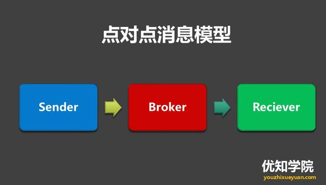
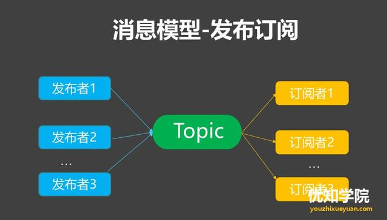

消息队列具有 低耦合、可靠投递、广播、流量控制、最终一致性 等一系列功能

# 核心原理

## 1.生产者、消费者、队列

- 消息生产者Producer：发送消息到消息队列。
- 消息消费者Consumer：从消息队列接收消息。
- Broker：指`MQ`的服务端，帮你把消息从发送端传送到接收端。
- 消息队列Queue：一个先进先出的消息存储区域。消息按照顺序发送接收，一旦消息被消费处理，该消息将从队列中删除。

## 2.设计Broker的主要考虑

> 简单理解就是一个消息转发器，把一次RPC做成两次RPC。发送者把消息投递到broker，broker再将消息转发一手到接收端。
>
> 总结起来就是两次RPC加一次转储，如果要做消费确认，则是三次RPC。

- 消息的转储：在更合适的时间点投递，或者通过一系列手段辅助消息最终能送达消费。
- 规范一种范式和通用的模式，以满足解耦、最终一致性、错峰等需求。

## 3.点对点消息队列模型

用于 消费生产者和消费消费者之间 点对点的通信



**三角色**：

- Queue
- Sender
- Receiver

每个message 都被发送到一个特定的Queue， Receiver从Queue中获取消息。

Queue中保留着消息，可以放在内存中也可以持久化，直到 消息被消费或超时。

**特点**

- 每个message 只有一个 Consumer，一旦被消费，消息就不再在Queue中
- Sender 和 Receiver 之间在时间上没有依赖性
- Receiver在成功接收消息之后需向 Queue应答成功

## 4.发布订阅消息模型

多个发布者将消息发送到Topic,系统将这些消息传递给多个订阅者



**三角色**

- 主题Topic
- 发布者Publisher
- 订阅者Subscriber

**特点**

- 每个消息可以有 多个Consumer：和点对点方式不同，发布消息可以被所有订阅者消费
- 发布者和订阅者之间有时间上的依赖性。
- 针对某个主题的订阅者，它必须创建一个订阅者之后，才能消费发布者的消息。
- 为了消费消息，订阅者必须保持运行的状态。

## 5.点对点和发布订阅的区别

- 生产者发送一条消息到Queue，只有一个消费者能收到。
- 发布者发送到topic的消息，只有订阅了topic的订阅者才会收到消息。

## 6.消息的顺序保证

基于Queue消息模型，利用FIFO先进先出的特性，可以保证消息的顺序性

## 7.消息的ACK机制

为了保证消息不丢失，消息队列提供了消息Acknowledge机制，即ACK机制。

当Consumer确认消息已经被消费处理，发送一个ACK给消息队列，此时消息队列便可以删除这个消息了。

如果Consumer宕机/关闭，没有发送ACK，消息队列将认为这个消息没有被处理，会将这个消息重新发送给其他的Consumer重新消费处理。

## 8.最终一致性的设计思路

**用"记录"和"补偿"的方式**

本地事务维护业务变化和通知消息，一起落地，然后RPC到达broker，在broker成功落地后，RPC返回成功，本地消息可以删除。否则本地消息一直靠定时任务轮询不断重发，这样就保证了消息可靠落地broker。

broker往consumer发送消息的过程类似，一直发送消息，直到consumer发送消费成功确认。

通过两次消息落地加补偿，下游是一定可以收到消息的。然后依赖状态机版本号等方式做判重，更新自己的业务，就实现了**最终一致性**。

**可能出现问题**

**消费方问题**处理过慢消费不来。

允许消费方主动ack error，并可以与broker约定下次投递的时间

**不确定丢失**，broker投递到consumer的消息，由于不确定丢失是在业务处理过程中还是消息发送丢失的情况下

有必要记录下投递的IP地址。决定重发之前询问这个IP，消息处理成功了吗？如果询问无果，再重发。

## 9.消息的事务支持

消息的收发处理支持事务

例如：在任务中心场景中，一次处理可能涉及多个消息的接收、处理，这应该处于同一个事务范围内，如果一个消息处理失败，事务回滚，消息重新回到队列中。

## 10.消息的持久化

启用消息持久化后，消息队列宕机重启后，消息可以从持久化存储恢复，消息不丢失，可以继续消费处理。

## 11.消息队列的高可用性

RabbitMQ的镜像集群模式的高可用性方案以及Kafka的Replication机制等。


# RPC

Remote Procedure Call，远程过程调用。主要解决远程通信的文问题。不需要了解底层网络的通信机制。

## 过程

### 1.建立通信

首先要解决通讯的问题：即A机器想要调用B机器，首先得建立起通信连接，主要是通过在客户端和服务器之间建立TCP连接。

### 2.服务寻址

要解决寻址的问题，A服务器上如何连接到B服务器（如主机或IP地址）以及特定的端口，方法的名称是什么。

### 3.网络传输

- 序列化
  - 当A服务器上的应用发起一个RPC调用时，调用方法和参数数据都需要先进行序列化。
- 反序列化
  - 当B服务器接收到A服务器的请求之后，又需要对接收到的参数等信息进行反序列化。

### 4.服务调用

B服务器进行本地调用（通过代理Proxy）之后得到了返回值，此时还需要再把返回值发送回A服务器，同样也需要经过序列化操作，然后再经过网络传输将二进制数据发送回A服务器。


# 2.RabbitMQ

RabbitMQ 是一个由 Erlang 语言开发的 AMQP 的开源实现。

AMQP ：Advanced Message Queue，高级消息队列协议。它是应用层协议的一个开放标准，为面向消息的中间件设计，基于此协议的客户端与消息中间件可传递消息，并不受产品、开发语言等条件的限制。

**特点**

1. 可靠性（Reliability） RabbitMQ 使用一些机制来保证可靠性，如持久化、传输确认、发布确认。
2. 灵活的路由（Flexible Routing） 在消息进入队列之前，通过 Exchange 来路由消息的
   - 对于典型的路由功能，RabbitMQ 已经提供了一些内置的 Exchange 来实现。
   - 针对更复杂的路由功能，可以将多个 Exchange 绑定在一起，也通过插件机制实现自己的 Exchange 。
3. 消息集群（Clustering） 多个 RabbitMQ 服务器可以组成一个集群，形成一个逻辑 Broker 。
4. 高可用（Highly Available Queues） 队列可以在集群中的机器上进行镜像，使得在部分节点出问题的情况下队列仍然可用。
5. 多种协议（Multi-protocol） RabbitMQ 支持多种消息队列协议，比如 STOMP、MQTT 等等。
6. 多语言客户端（Many Clients） RabbitMQ 几乎支持所有常用语言，比如 Java、.NET、Ruby 等等。
7. 管理界面（Management UI） RabbitMQ 提供了一个易用的用户界面，使得用户可以监控和管理消息 Broker 的许多方面。
8. 跟踪机制（Tracing） 如果消息异常，RabbitMQ 提供了消息跟踪机制，使用者可以找出发生了什么。
9. 插件机制（Plugin System） RabbitMQ 提供了许多插件，来从多方面进行扩展，也可以编写自己的插件

## 2.1概念

### 消息模型

生产者 创建消息, 发布到队列中. 将消息发送到 监听的消费者


### 2.1.1.Message消息

消息是不具名的，它由消息头和消息体组成。消息体是不透明的，而消息头则由一系列的可选属性组成，这些属性包括

- routing-key（路由键）
- priority（相对于其他消息的优先权）
- delivery-mode（指出该消息可能需要持久性存储）等。

### 2.1.2.Publisher消息的生产者

是一个向交换器发布消息的客户端应用程序。

### 2.1.3.Exchange交换器

用来接收生产者发送的消息并将这些消息路由给服务器中的队列。

### 2.1.4.Queue消息队列

用来保存消息直到发送给消费者。它是消息的容器，也是消息的终点。一个消息可投入一个或多个队列。消息一直在队列里面，等待消费者连接到这个队列将其取走。

### 2.1.5.Channel信道

多路复用连接中的一条独立的双向数据流通道。

信道是建立在真实的TCP连接内地虚拟连接，AMQP 命令都是通过信道发出去的，不管是发布消息、订阅队列还是接收消息，这些动作都是通过信道完成。

因为对于操作系统来说建立和销毁 TCP 都是非常昂贵的开销，所以引入了信道的概念，以复用一条 TCP 连接。

### 2.1.6.Consumer消息的消费者

表示一个从消息队列中取得消息的客户端应用程序。

### 2.1.7.Broker

表示消息队列服务器实体。

### 2.1.8.Binding绑定

用于消息队列和交换器之间的关联。一个绑定就是基于路由键将交换器和消息队列连接起来的路由规则，所以可以将交换器理解成一个由绑定构成的路由表。

### 2.1.9.Connection网络连接

比如一个TCP连接。

### 2.1.10.Virtual Host虚拟主机

表示一批交换器、消息队列和相关对象。虚拟主机是共享相同的身份认证和加密环境的独立服务器域。每个 vhost 本质上就是一个 mini 版的 RabbitMQ 服务器，拥有自己的队列、交换器、绑定和权限机制。vhost 是 AMQP 概念的基础，必须在连接时指定，RabbitMQ 默认的 vhost 是 / 。

## 2.2AMQP中的消息路由

生产者把消息发布到 Exchange 上，消息最终到达队列并被消费者接收，而 Binding 决定交换器的消息应该发送到那个队列。


### exchange类型

**四种类型**：

- direct
- fanout
- topic
- headers 

**headers** 匹配 AMQP 消息的 header 而不是路由键，此外 headers 交换器和 direct 交换器完全一致，但性能差很多，目前几乎用不到了

#### direct


消息中的路由键（routing key）如果和 Binding 中的 binding key 一致， 交换器就将消息发到对应的队列中。路由键与队列名完全匹配。它是完全匹配、单播的模式。

#### fanout


每个发到 fanout 类型交换器的消息都会分到所有绑定的队列上去。fanout 交换器不处理路由键，只是简单的将队列绑定到交换器上，每个发送到交换器的消息都会被转发到与该交换器绑定的所有队列上。fanout 类型转发消息是最快的。

#### topic


topic 交换器通过模式匹配分配消息的路由键属性，将路由键和某个模式进行匹配，此时队列需要绑定到一个模式上。它将路由键和绑定键的字符串切分成单词，这些单词之间用点隔开。它同样也会识别两个通配符

- #匹配0个或多个单词
- *匹配不多不少一个单词。

## 2.3安装

1. 前提安装好erlang

2. 接着安装rabbitmq服务器

   ```
   pip install rabbitmq
   ```

## 2.4运行和管理

### 2.4.1启动

找到安装后的 RabbitMQ 所在目录下的 sbin 目录，可以看到该目录下有6个以 rabbitmq 开头的可执行文件，直接执行 rabbitmq-server 即可

**后台启动**

加上 `-detached` 参数

### 2.4.2查询服务器状态

sbin 目录下有个特别重要的文件叫 rabbitmqctl ，它提供了 RabbitMQ 管理需要的几乎一站式解决方案，绝大部分的运维命令它都可以提供。 

查询 RabbitMQ 服务器的状态信息可以用参数 `status `

```
rabbitmqctl status
```

### 2.4.3关闭rabbitmq节点

RabbitMQ 是用 Erlang 语言写的，在Erlang 中有两个概念：节点和应用程序。

节点就是 Erlang 虚拟机的每个实例，而多个 Erlang 应用程序可以运行在同一个节点之上。节点之间可以进行本地通信（不管他们是不是运行在同一台服务器之上）。

比如一个运行在节点A上的应用程序可以调用节点B上应用程序的方法，就好像调用本地函数一样。如果应用程序由于某些原因奔溃，Erlang 节点会自动尝试重启应用程序。

关闭整个 RabbitMQ 节点可以用参数 `stop `

```
rabbitmqctl stop
```

**指定关闭不同的节点**

加上 `-n` 参数

### 2.4.4重置rabbitmq节点

```
rabbitmqctl reset
```

该命令将清除所有的队列。

### 2.4.5关闭rabbitmq应用程序

只想关闭应用程序，同时保持 Erlang 节点运行则可以用 stop_app

```
rabbitmqctl stop_app
```

### 2.4.6启动rabbitmq应用程序

```
rabbitmqctl start_app
```

### 2.4.7查看已声明的队列

```
rabbitmqctl list_queues
```

### 2.4.8查看交换器

```
rabbitmqctl list_exchanges
```

附加参数，比如列出交换器的名称、类型、是否持久化、是否自动删除

```
rabbitmqctl list_exchanges name type durable auto_delete
```

### 2.4.9查看绑定

```
rabbitmqctl list_bindings
```

## 2.5集群

内建集群设计的目的是允许消费者和生产者在节点崩溃的情况下继续运行，以及通过添加更多的节点来线性扩展消息通信吞吐量。

RabbitMQ 内部利用 Erlang 提供的分布式通信框架 OTP 来满足上述需求，使客户端在失去一个 RabbitMQ 节点连接的情况下，还是能够重新连接到集群中的任何其他节点继续生产、消费消息。

### 2.5.1概念

RabbitMQ 会始终记录以下四种类型的内部元数据：

1. 队列元数据 包括队列名称和它们的属性，比如是否可持久化，是否自动删除
2. 交换器元数据 交换器名称、类型、属性
3. 绑定元数据 内部是一张表格记录如何将消息路由到队列
4. vhost 元数据 为 vhost 内部的队列、交换器、绑定提供命名空间和安全属性

### 2.5.2集群与单一节点比较

**单一节点**

RabbitMQ 会将所有这些信息存储在内存中，同时将标记为可持久化的队列、交换器、绑定存储到硬盘上。

**集群**

集群模式下同样也提供两种选择：存到硬盘上（独立节点的默认设置），存在内存中。

### 2.5.3

集群中创建队列，集群只会在单个节点而不是所有节点上创建完整的队列信息（元数据、状态、内容）。结果是只有队列的所有者节点知道有关队列的所有信息，因此当集群节点崩溃时，该节点的队列和绑定就消失了，并且任何匹配该队列的绑定的新消息也丢失了。还好RabbitMQ 2.6.0之后提供了镜像队列以避免集群节点故障导致的队列内容不可用。

集群中可以共享 user、vhost、exchange等，除了消息队列，所有的数据和状态都是必须在所有节点上复制的

在集群中声明队列、交换器、绑定的时候，这些操作会直到所有集群节点都成功提交元数据变更后才返回。集群中有内存节点和磁盘节点两种类型，内存节点虽然不写入磁盘，但是它的执行比磁盘节点要好。内存节点可以提供出色的性能，磁盘节点能保障配置信息在节点重启后仍然可用

**平衡磁盘节点和内存结点**

要求集群中至少有一个磁盘节点，所有其他节点可以是内存节点，当节点加入或离开集群时，它们必须要将该变更通知到至少一个磁盘节点。如果只有一个磁盘节点，刚好又是该节点崩溃了，那么集群可以继续路由消息，但不能创建队列、创建交换器、创建绑定、添加用户、更改权限、添加或删除集群节点。换句话说集群中的唯一磁盘节点崩溃的话，集群仍然可以运行，但直到该节点恢复，否则无法更改任何东西。

### 2.5.4集群配置和启动

单机器启动多个 RabbitMQ 节点来组建集群的话，会导致启动第二、第三个节点将会因为节点名称和端口冲突导致启动失败。

所以在每次调用 rabbitmq-server 命令前，设置环境变量 RABBITMQ_NODENAME 和 RABBITMQ_NODE_PORT 来明确指定唯一的节点名称和端口

```
// 启动第一个节点
RABBITMQ_NODENAME=test_rabbit_1 RABBITMQ_NODE_PORT=5672 ./sbin/rabbitmq-server -detached
// 启动第二个节点
RABBITMQ_NODENAME=test_rabbit_2 RABBITMQ_NODE_PORT=5673 ./sbin/rabbitmq-server -detached
```

- 启动第2个节点前建议将 RabbitMQ 默认激活的插件关掉，否则会存在使用了某个插件的端口号冲突，导致节点启动不成功。

现在第2个节点和第1个节点都是独立节点，它们并不知道其他节点的存在。集群中除第一个节点外后加入的节点需要获取集群中的元数据，所以要先停止 Erlang 节点上运行的 RabbitMQ 应用程序，并重置该节点元数据，再加入并且获取集群的元数据，最后重新启动 RabbitMQ 应用程序。

1. 停止第2个节点的应用程序：

   ```
   ./sbin/rabbitmqctl -n test_rabbit_2 stop_app
   ```

2. 重置第2个节点元数据：

   ```
   ./sbin/rabbitmqctl -n test_rabbit_2 reset
   ```

3. 第2节点加入第1个节点组成的集群：

   ```
   ./sbin/rabbitmqctl -n test_rabbit_2 join_cluster test_rabbit_1@localhost
   ```

4. 启动第2个节点的应用程序

   ```
   ./sbin/rabbitmqctl -n test_rabbit_2 start_app
   ```

第3个节点的配置过程和第2个节点类似：

```
RABBITMQ_NODENAME=test_rabbit_3 RABBITMQ_NODE_PORT=5674 ./sbin/rabbitmq-server -detached

./sbin/rabbitmqctl -n test_rabbit_3 stop_app

./sbin/rabbitmqctl -n test_rabbit_3 reset

./sbin/rabbitmqctl -n test_rabbit_3 join_cluster test_rabbit_1@localhost

./sbin/rabbitmqctl -n test_rabbit_3 start_app
```

### 2.5.5集群运维

停止某个指定的节点，比如停止第2个节点：

```
RABBITMQ_NODENAME=test_rabbit_2 ./sbin/rabbitmqctl stop
```

查看节点3的集群状态：

```
./sbin/rabbitmqctl -n test_rabbit_3 cluster_status
```